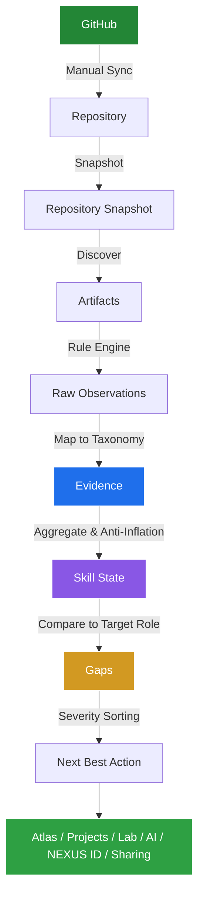

# NEXUS

## Engineering Intelligence

"NEXUS turns the engineering work you build into evidence of what you can prove, what you need to strengthen, and what to build next."

NEXUS connects engineering work, observable evidence, skill signals, project intelligence, learning, AI-assisted reflection, and shareable engineering identity into one system.

## THE PHILOSOPHY
# BUILD → PROVE → UNDERSTAND → DEFEND → PRESENT → SHARE

**BUILD**
Students create real engineering work in their own repositories.

**PROVE**
NEXUS observes engineering evidence from connected work, analyzing code without making subjective claims.

**UNDERSTAND**
Students explore Project Intelligence and the Engineering Lab to deeply understand their own capabilities and gaps.

**DEFEND**
Students use the AI Engineering Copilot for project-specific interview experiences and architectural defense.

**PRESENT**
Students create a NEXUS ID—an evidence-backed public engineering profile.

**SHARE**
Students can share selected engineering evidence through permission-controlled ecosystem features for mentors, educators, and teams.

## THE PROBLEM NEXUS SOLVES

Students often struggle to understand:
- what their projects actually demonstrate
- whether their claimed skills have observable proof
- what skills remain under-evidenced
- what to build next
- how to improve existing projects
- how to explain their own technical decisions
- how to present engineering work credibly
- how to share engineering evidence safely

NEXUS connects those disconnected pieces into a unified, deterministic framework that replaces self-assessment with verifiable evidence.

## HOW NEXUS WORKS

THE DETERMINISTIC NEXUS LAYER IS THE SOURCE OF TRUTH.
AI is an experience layer.
Public profiles are a presentation layer.
Sharing is a permission layer.



## EVIDENCE BEFORE CLAIMS

NEXUS does not simply trust a student saying: *"I know Docker."*
Instead, it looks for observable engineering evidence (e.g., Dockerfiles, docker-compose configurations). A lack of evidence is NOT automatically treated as proof of inability—it is simply unexplored territory.

NEXUS classifies capabilities into verifiable states:
- **PROVEN**: Strong, repeated evidence across multiple artifacts.
- **DEVELOPING**: Emerging evidence, but lacks depth or repetition.
- **WEAK**: Minimal or isolated evidence.
- **UNEXPLORED**: No verifiable engineering evidence observed in surveyed repositories yet.

## PRODUCT CAPABILITIES

### Engineering Atlas
Interactive 2D Technical Cartography view of your engineering identity. 

### Evidence / Proof
Trace how engineering signals are supported by objective, observable evidence.

### Signals
See current capability states (Proven, Developing, Weak) backed by real engineering work.

### Unexplored
Understand role-relevant areas where NEXUS currently lacks sufficient evidence.

### Next Expedition
Deterministic next action based on severity-sorted capability gaps against a target role.

### Proof Quests
Turn evidence gaps into concrete engineering build missions.

### Project Intelligence
Understand what individual projects actually demonstrate, their technical anatomy, and how they can evolve.

### Engineering Lab
Learn engineering concepts through the context of the work you have already built.

### AI Engineering Copilot
Explain, teach, challenge, and conduct project-specific interviews using verified NEXUS context. The AI challenges your understanding but does not evaluate your skill state.

### NEXUS ID
An evidence-backed engineering passport and public profile representing your proven capabilities.

### Ecosystem
Dedicated permissioned experiences for Mentors, Reviewers, Educators, and Teams.

## SIGNATURE EXPERIENCE: FOLLOW THE PROOF

One of NEXUS's defining interactions is the ability to trace any claim back to reality:

**Skill** (e.g., API Development)
↓
**Project** (e.g., E-Commerce Backend)
↓
**Evidence** (e.g., FastAPI Router implementation)
↓
**Field Note** (Exact context of discovery)

## ENGINEERING ATLAS

NEXUS abandons traditional dashboards for a 2D engineering atlas built with SVG, HTML, CSS, and Vanilla JS.

- **Target Role** → Destination
- **Engineering Domains** → Territories
- **Projects** → Landmarks
- **Skills** → Signals
- **Evidence** → Proof Paths
- **Gaps** → Unexplored Territory
- **Journey** → Route / Expedition Log
- **Next Best Action** → Next Expedition

## PROJECT INTELLIGENCE

NEXUS project pages do not rely on fabricated quality scores. Instead, they answer:
- WHAT DID I BUILD?
- WHAT DID NEXUS FIND?
- WHAT DOES IT PROVE?
- WHAT IS DEVELOPING?
- WHAT IS STILL UNEXPLORED?
- WHAT COULD GROW NEXT?

## PROOF QUESTS

A gap in NEXUS can become a concrete engineering mission.
*Example:* 
Testing Gap → **PROVE TESTING** → Build tests → Push to GitHub → Sync → Generate Evidence → Recalculate Skill State.

*CRITICAL:* "Marked complete" in a UI is NOT equivalent to "verified evidence." Only authoritative engineering evidence pushed to a repository can change a skill state.

## ENGINEERING LAB

Students learn concepts through the work they already built. The loop:
PROJECT → OBSERVED CONCEPT → UNDERSTAND → TRY → EXPLAIN → RETURN TO PROJECT

## AI ENGINEERING COPILOT

NEXUS strictly separates deterministic truth from AI experiences.

**NEXUS deterministic layer determines:**
evidence, skills, gaps, quests, and project truth.

**AI layer can only:**
explain, teach, challenge, interview, and coach.

The AI does NOT determine skill state, evidence validity, gap analysis, or quest verification. This boundary ensures product trust.

## NEXUS ID

An evidence-backed engineering passport. 
It communicates your target role, proven signals, developing signals, selected projects, verified proof, and selected journey to shape a public engineering identity.

It is **NOT** an ATS score, a vanity metric, a popularity profile, or a fake readiness percentage.

## ECOSYSTEM

NEXUS features ONE TRUTH with DIFFERENT PERMISSIONED VIEWS. Student ownership remains central.

- **Student:** Full control and ownership of data.
- **Mentor:** Scoped dossier access with the ability to leave private engineering notes.
- **Reviewer:** Temporary, time-limited project proof sheets.
- **Educator:** Cohort aggregated observatory (requires ≥ 6 students for privacy).
- **Team:** Project-level sharing for neutral collaboration signals.

## SECURITY & PRIVACY

NEXUS implements strict security protections:
- Secure password hashing (bcrypt)
- HTTP-Only secure cookies with session rotation
- CSRF protection via double-submit cookies/headers
- In-memory rate limiting
- Strict cross-user ownership isolation
- Password reset token hashing
- Public/private visibility controls
- Zero persistence of GitHub source code (analyzed in memory only)

## DATA OWNERSHIP

Users own their accounts and engineering identity. Sharing is explicit and instantly revocable. Private data remains private. AI does not override ownership. Mentors do not alter engineering truth. Educators only see aggregate information. Public profiles expose only selected content.

## TECH STACK

| Layer | Technology |
|---|---|
| Backend | FastAPI (Python 3) |
| ORM | SQLAlchemy |
| Database | PostgreSQL (psycopg v3) |
| Migrations | Alembic |
| Templates | Jinja2 |
| Frontend | HTML / CSS / Vanilla JS |
| Visualization | SVG (Engineering Atlas) |
| Authentication | Passlib (bcrypt), python-jose (JWT) |
| Deployment | Render |

## ARCHITECTURE

```text
                NEXUS
                  │
        ┌─────────┴─────────┐
        │                   │
   Deterministic        Experience
     Engines              Layer
        │                   │
  Evidence           Atlas / Projects
  Skills             Proof / Lab
  Gaps               AI / NEXUS ID
  NBA                 Sharing
        │
     PostgreSQL
        │
     GitHub
```
