# NEXUS: Product Definition & Vision

**Document Version:** 1.0.0  
**Status:** Canonical Source of Truth  
**Target Domain:** Intelligent Workflow & Context-to-Action Execution  

---

## 1. Executive Summary

In every organization and knowledge domain, high-value information is continuously transmitted across fragmented communication channels—technical specifications, RFCs, regulatory updates, Slack/Teams chats, board resolutions, email threads, customer tickets, and meeting recordings. 

Modern professionals suffer from **Context Fragmentation and Execution Drift**:
1. Information is scattered across isolated tools without a unified context graph.
2. People must manually read every piece of information to assess whether it applies to them or their projects.
3. Converting unstructured data into actionable work items requires high manual effort.
4. Implicit deadlines, multi-party dependencies, and prerequisite approvals are routinely missed.
5. Systems fail to verify whether an action was truly completed with verifiable evidence.

**NEXUS** is an open-source **Context-to-Action Engine** that systematically transforms multi-source inputs into personalized, source-grounded, dependency-aware actions and verifies their execution.

---

## 2. Core Transformation Equation

$$\text{Fragmented Inputs} \longrightarrow \mathbf{Context} \longrightarrow \mathbf{Understanding} \longrightarrow \mathbf{Actions} \longrightarrow \mathbf{Dependencies} \longrightarrow \mathbf{Execution} \longrightarrow \mathbf{Verification}$$

```mermaid
flowchart LR
    subgraph Inputs["1. Fragmented Inputs"]
        DOC[Documents & PDFs]
        MSG[Messages & Emails]
        MEET[Meeting Transcripts]
        API[External Systems]
    end

    subgraph Core["2. NEXUS Engine"]
        CTX[Context Graph & Entities]
        UND[Semantic Extraction]
        ACT[Action Synthesizer]
        DEP[Dependency Resolver]
    end

    subgraph Outcomes["3. Grounded Outcomes"]
        EXEC[Human / System Action]
        VERIF[Evidence Verification]
    end

    Inputs --> CTX --> UND --> ACT --> DEP --> EXEC --> VERIF
```

---

## 3. The Core Abstraction: The Action Graph

NEXUS does not treat tasks as flat to-do lists. It constructs and maintains a living **Action Graph** consisting of strictly typed entities and typed edges:

### Primary Entities (Nodes)
- **User / Persona:** The organizational actor with skills, roles, and assigned projects.
- **Document / Source:** The immutable raw input artifact with cryptographic digest and chunk lineage.
- **Fact / Assertion:** Grounded atomic claims extracted from sources with explicit confidence levels.
- **Task / Action:** Concrete work items requiring human or automated effort.
- **Deadline / Milestone:** Temporal constraints extracted with timezones and relative anchor resolutions.
- **Project / Goal:** Higher-level objective groupings aggregating related actions.
- **Requirement / Constraint:** Policy, regulatory, or technical criteria governing task execution.
- **Approval / Gate:** Explicit human authorization checkpoints for consequential actions.
- **Evidence / Verification:** Proof of completion (commit hash, document signature, API response, artifact).

### Canonical Relationships (Edges)
- `(Document) -[:applies_to]-> (User | Project)`
- `(Document) -[:asserts]-> (Fact)`
- `(Fact) -[:creates]-> (Task)`
- `(Task) -[:depends_on]-> (Task)`
- `(Task) -[:requires]-> (Approval | Requirement)`
- `(Task) -[:due_on]-> (Deadline)`
- `(Task) -[:completed_by]-> (Evidence)`

---

## 4. What NEXUS Is NOT (Anti-Goals)

To prevent mission drift and bloat, NEXUS explicitly enforces the following architectural boundaries:

| Anti-Goal | Reason & Boundary |
| :--- | :--- |
| **Generic Chatbot** | NEXUS is an action synthesis and execution verification engine, not a conversational playground. |
| **Superficial RAG / Simple Search** | Merely retrieving text chunks is insufficient; NEXUS extracts structured semantic models with validated schemas. |
| **Black-box Autonomous Agents** | NEXUS rejects ungrounded, uncontrolled agent loops. Actions are structured, bounded, and human-authorized. |
| **Generic Note-Taking App** | NEXUS is dynamic, event-driven, and focused on dependency graphs and state tracking. |
| **AI Wrapper** | Core business logic, authorization, dependency resolution, and state machines are deterministic code, not LLM prompts. |

---

## 5. Primary Personas & Use Cases

### Persona A: Technical Project Leads & Engineers
- **Problem:** RFCs, architectural decisions, and Slack discussions create dozens of implicit code changes, deprecations, and test requirements.
- **NEXUS Solution:** Ingests RFCs and technical documentation, generates an Action Graph of engineering tasks with prerequisites and verification targets (e.g., test suites, PR merges).

### Persona B: Operations, Compliance & Governance Leads
- **Problem:** Regulatory audits, compliance checklists, and vendor contracts involve strict multi-step approvals and deadline-sensitive mandates.
- **NEXUS Solution:** Extracts compliance requirements, matches actions to assigned roles, enforces gatekeeper approvals, and attaches cryptographic evidence to prove fulfillment.

### Persona C: Executive & Product Management
- **Problem:** Cross-departmental initiatives stall because blockers between teams are hidden in separate tools (Jira, Google Docs, Slack).
- **NEXUS Solution:** Cross-source dependency resolution maps blocking actions across teams, exposing critical path bottlenecks in real time.
