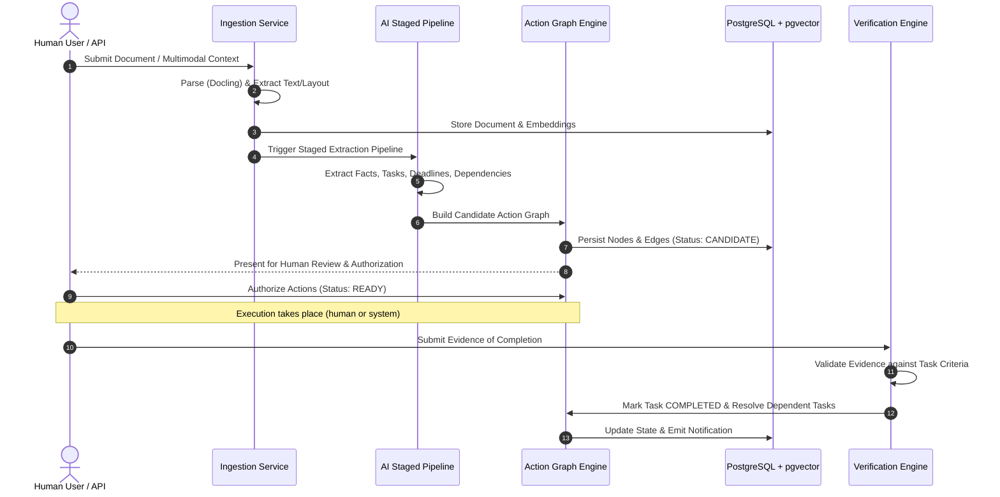

# NEXUS: System Architecture

**Document Version:** 1.0.0  
**Status:** Canonical Source of Truth  
**Target Domain:** Modular Context-to-Action Platform Architecture  

---

## 1. High-Level Architecture Overview

NEXUS is designed around a **hexagonal / modular monolith architecture** with clean domain separation. This guarantees local simplicity, fast developer iteration, strict testability, and a clear migration path toward distributed worker services if scaling demands arise.

```mermaid
flowchart TB
    subgraph ClientLayer["Frontend Presentation Layer (Next.js / React / TypeScript)"]
        UI_DASH[Action Graph Dashboard]
        UI_INGEST[Document Ingestion Workbench]
        UI_VERIF[Evidence & Verification Hub]
        UI_SETTINGS[Provider & System Settings]
    end

    subgraph APILayer["API Gateway & Core Application (FastAPI / Python)"]
        AUTH[AuthN & AuthZ Middleware (RBAC / PBAC)]
        ROUTER_INGEST[Ingestion Router]
        ROUTER_GRAPH[Action Graph Router]
        ROUTER_ACTIONS[Action Management Router]
        ROUTER_VERIF[Verification Router]
    end

    subgraph DomainServices["Core Domain Services"]
        INGEST_SERVICE[Ingestion & Parsing Engine (Docling)]
        AI_PIPELINE[Staged AI Pipeline Orchestrator]
        GRAPH_ENGINE[Action Graph & Dependency Engine]
        VERIF_ENGINE[Evidence Verification Engine]
        NOTIF_ENGINE[Event & Notification Dispatcher]
    end

    subgraph LLMAbstraction["Provider-Agnostic AI Layer"]
        LLM_ADAPTER[LLM Provider Adapter]
        GEMINI_PROV[Gemini Adapter]
        OLLAMA_PROV[Ollama Adapter (Local)]
        HF_PROV[HuggingFace Adapter]
    end

    subgraph PersistenceLayer["Data & State Infrastructure"]
        PG[(PostgreSQL 16+ with pgvector)]
        REDIS[(Redis / Task Queue & Cache)]
        BLOB[(Object Storage / Local File Storage)]
    end

    subgraph ObservabilityLayer["Observability & Evaluation"]
        LANGFUSE[Langfuse AI Observability]
        OTEL[OpenTelemetry Application Telemetry]
    end

    ClientLayer -->|REST / SSE / WebSockets| APILayer
    APILayer --> DomainServices
    AI_PIPELINE --> LLM_ADAPTER
    LLM_ADAPTER --> GEMINI_PROV
    LLM_ADAPTER --> OLLAMA_PROV
    LLM_ADAPTER --> HF_PROV
    DomainServices --> PersistenceLayer
    AI_PIPELINE -.-> ObservabilityLayer
    APILayer -.-> ObservabilityLayer
```

---

## 2. Layered Subsystems

### 2.1 Frontend Presentation Layer (Next.js 15+ / React 19)
- **Role:** Interactive Action Graph visualization, human-in-the-loop review workbench, document ingestion status, and verification evidence submission.
- **Key Capabilities:**
  - Dynamic DAG visualization for task dependencies (React Flow / custom SVG graph canvas).
  - Source-grounded side-by-side document inspection with bounding box and snippet highlights.
  - Interactive approval gates with one-click authorization.
  - Responsive, dark-mode-first aesthetic with zero visual clutter.

### 2.2 API & Application Layer (FastAPI / Pydantic v2 / Python 3.12+)
- **Role:** High-performance asynchronous API handling, validation, business rule execution, and session management.
- **Key Capabilities:**
  - Deterministic input/output validation using Pydantic v2 schemas.
  - Strict application-enforced authorization (never delegated to LLMs).
  - Background asynchronous task handling via Celery / Redis or FastAPI BackgroundTasks for local environments.
  - Streaming endpoints (Server-Sent Events) for real-time extraction and verification feedback.

### 2.3 Core Domain Engine
1. **Ingestion & Document Pipeline:** Normalizes PDF, DOCX, Markdown, HTML, and images into structured chunk documents using Docling with layout analysis and OCR.
2. **Action Graph & Dependency Engine:** Maintains DAG topology, cycles detection, critical path calculation, and topological sorting of task execution.
3. **Evidence Verification Engine:** Ingests evidence payloads (text, links, files, system events), validates cryptographic checksums, and tests fulfillment conditions.

### 2.4 Provider-Agnostic AI Layer
- Decouples application logic from specific model SDKs.
- Supports runtime switching between hosted (Gemini 1.5 Pro / Flash) and local (Ollama / LLaMA 3) models.
- Enforces JSON Schema structured output with native retries, fallbacks, and schema validation.

### 2.5 Persistence & Search Layer
- **PostgreSQL 16+:** Relational storage for users, documents, tasks, dependencies, approvals, and evidence audit logs.
- **pgvector:** Dense vector similarity search for semantic chunk retrieval and context matching.
- **Redis:** Fast cache, pub/sub for real-time UI updates, and queue for asynchronous background jobs.

---

## 3. Communication & Data Flow



---

## 4. Resilience & Graceful Degradation

- **LLM Rate Limiting & Failover:** Automatic exponential backoff with jitter and fallback to secondary configured providers (e.g., Gemini -> Local Ollama).
- **Asynchronous Task Processing:** Long-running document parsing and graph synthesis are handled asynchronously with progress events.
- **Database Partitioning & Indexing:** Graph edge queries leverage b-tree indexes on `(source_id, relation_type)` and `(target_id, relation_type)`.
