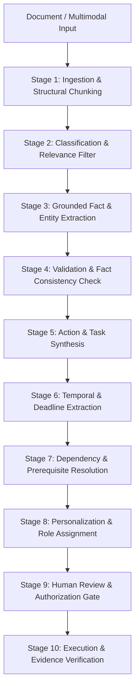

# NEXUS: AI Architecture & Staged Pipeline

**Document Version:** 1.0.0  
**Status:** Canonical Source of Truth  

---

## 1. Staged AI Pipeline Philosophy

NEXUS strictly rejects "single giant monolithic prompt" approaches. Monolithic prompts lead to high hallucination rates, opaque errors, untraceable reasoning, and lack of schema enforcement.

NEXUS breaks AI context processing into **discrete, deterministic stages**, each with:
- Dedicated, versioned prompt template
- Strict input context contract
- Validated Pydantic output schema
- Deterministic validation & error retry loop
- Source attribution preservation
- Observability and cost tracking (Langfuse)

*For details on how NEXUS communicates with AI models abstractly, see [13_AI_PROVIDER_GATEWAY.md](./13_AI_PROVIDER_GATEWAY.md).*

---

## 2. End-to-End Pipeline Stages



### Detailed Stage Breakdown

#### Stage 1: Ingestion & Structural Chunking (Non-LLM / Deterministic)
- **Input:** Raw binary file (PDF, DOCX, MD, Image, Audio Transcript).
- **Engine:** Docling + OCR.
- **Output:** Structured Document representation with hierarchical layout (sections, tables, paragraphs) and cryptographic chunk digests.

#### Stage 2: Classification & Domain Filtering (Fast LLM / Mini Model)
- **Input:** Document title, summary chunk, metadata.
- **Model:** Fast model (e.g. Gemini 1.5 Flash, Ollama LLaMA 3 8B).
- **Output Schema:** Document type (RFC, Policy, Meeting, Audit, Message), domain category, and broad relevance flags.

#### Stage 3: Grounded Fact & Entity Extraction
- **Input:** Structured document sections + chunk lineage.
- **Output Schema:** List of atomic `Fact` entities with exact verbatim text citations, page/line numbers, confidence scores, and entity links (People, Systems, Policies).
- **Rule:** If an assertion has no verbatim backing, it is marked `UNKNOWN` and discarded from core facts.

#### Stage 4: Fact Consistency & Validation Check
- **Input:** Extracted candidate facts across chunks.
- **Output:** Conflict detection. If Fact A contradicts Fact B, flags state as `CONFLICT` with both source citations.

#### Stage 5: Action & Task Synthesis
- **Input:** Validated Facts + Project/User context.
- **Output Schema:** List of candidate `Task` objects:
  - `title`: Short imperative action title
  - `description`: Detailed specification of work
  - `action_type`: `MANUAL`, `AUTOMATED`, `APPROVAL`, `INVESTIGATION`
  - `priority`: `P0` (Critical), `P1` (High), `P2` (Medium), `P3` (Low)
  - `source_fact_ids`: List of grounded fact references

#### Stage 6: Temporal & Deadline Extraction
- **Input:** Task text + Temporal references + Reference document timestamp.
- **Output Schema:** Absolute ISO-8601 timestamps, recurrence rules, timezone resolution, or `UNKNOWN` if not specified.

#### Stage 7: Dependency & Prerequisite Resolution
- **Input:** All extracted tasks + existing Action Graph state.
- **Output Schema:** Directed edges `(Task A) -[:depends_on]-> (Task B)`, required external approvals `(Task A) -[:requires]-> (Approval)`.
- **Validation:** Graph topological cycle detection (deterministic Python algorithm). Cycles trigger `REQUIRES_REVIEW`.

#### Stage 8: Personalization & Role Assignment
- **Input:** Extracted tasks + Organization User Graph (skills, roles, ownership).
- **Output Schema:** Suggested assignee(s), rationale for assignment, confidence score.

#### Stage 9: Human Review & Authorization Gate
- **Deterministic Check:** High-impact actions are held in `CANDIDATE` state until human reviewer grants explicit authorization.

#### Stage 10: Execution & Verification
- **Input:** Completed task + submitted evidence (Git commit, URL, document upload, system event).
- **Evaluation:** Evaluator prompt / rule engine compares evidence against task criteria, verifying completeness before marking `COMPLETED`.

---

## 3. Structured Output & Validation Loop

```mermaid
flowchart LR
    Prompt[Prompt + Context + JSON Schema] --> LLM[LLM Provider]
    LLM --> RawOutput[Raw JSON Output]
    RawOutput --> Validator{Pydantic v2 Validation}
    Validator -->|Success| CleanModel[Validated Domain Object]
    Validator -->|Validation Error| RepairPrompt[Error Repair Loop (Max 2)]
    RepairPrompt --> LLM
    Validator -->|Max Retries Exceeded| Fallback[Flag as REQUIRES_REVIEW / Fallback]
```
