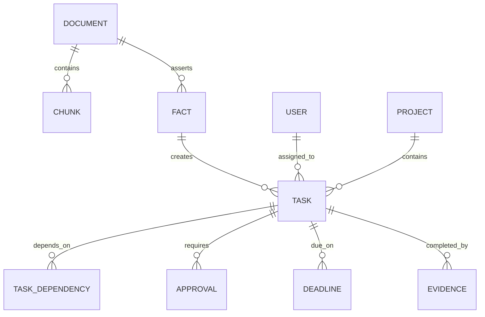
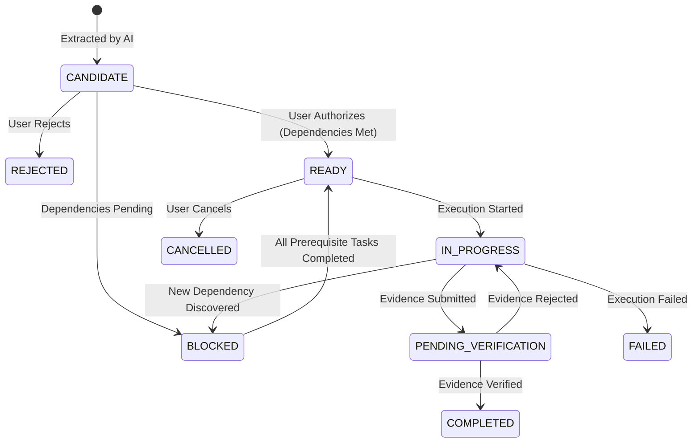

# NEXUS: Data Model & Action Graph Specification

**Document Version:** 1.0.0  
**Status:** Canonical Source of Truth  

---

## 1. Action Graph Conceptual Model

The NEXUS Action Graph is modeled as typed nodes and typed directed edges.



---

## 2. Core Entities & State Machines

### 2.1 Task State Machine



### 2.2 Core Enumerations

```python
class TaskStatus(str, Enum):
    CANDIDATE = "CANDIDATE"              # Newly extracted, awaiting human review
    BLOCKED = "BLOCKED"                  # Blocked by prerequisite tasks
    READY = "READY"                      # Ready for execution
    IN_PROGRESS = "IN_PROGRESS"          # Currently being worked on
    PENDING_VERIFICATION = "PENDING_VERIFICATION" # Evidence submitted, under test
    COMPLETED = "COMPLETED"              # Formally verified and finished
    REJECTED = "REJECTED"                # Dismissed during review
    FAILED = "FAILED"                    # Attempted but failed execution
    CANCELLED = "CANCELLED"              # Deprecated or cancelled

class ConfidenceLevel(str, Enum):
    HIGH = "HIGH"                        # Direct explicit statement (>0.85)
    MEDIUM = "MEDIUM"                    # Clear inference (>0.60)
    REQUIRES_REVIEW = "REQUIRES_REVIEW"  # Ambiguous (<0.60)
    UNKNOWN = "UNKNOWN"                  # No evidence found
    CONFLICT = "CONFLICT"                # Contradictory evidence across sources

class EdgeRelationType(str, Enum):
    APPLIES_TO = "applies_to"
    ASSERTS = "asserts"
    CREATES = "creates"
    DEPENDS_ON = "depends_on"
    REQUIRES = "requires"
    DUE_ON = "due_on"
    COMPLETED_BY = "completed_by"
    BLOCKS = "blocks"
    SUPERSEDES = "supersedes"
```

---

## 3. Relational Schema Definition (PostgreSQL + pgvector)

```sql
-- Extensions
CREATE EXTENSION IF NOT EXISTS "uuid-ossp";
CREATE EXTENSION IF NOT EXISTS "vector";

-- 1. Tenants & Users
CREATE TABLE tenants (
    id UUID PRIMARY KEY DEFAULT uuid_generate_v4(),
    name VARCHAR(255) NOT NULL,
    created_at TIMESTAMPTZ NOT NULL DEFAULT NOW()
);

CREATE TABLE users (
    id UUID PRIMARY KEY DEFAULT uuid_generate_v4(),
    tenant_id UUID NOT NULL REFERENCES tenants(id) ON DELETE CASCADE,
    email VARCHAR(255) NOT NULL UNIQUE,
    full_name VARCHAR(255) NOT NULL,
    role VARCHAR(64) NOT NULL DEFAULT 'member',
    skills JSONB DEFAULT '[]'::jsonb,
    is_active BOOLEAN NOT NULL DEFAULT TRUE,
    created_at TIMESTAMPTZ NOT NULL DEFAULT NOW(),
    updated_at TIMESTAMPTZ NOT NULL DEFAULT NOW()
);

-- 2. Documents & Chunks
CREATE TABLE documents (
    id UUID PRIMARY KEY DEFAULT uuid_generate_v4(),
    tenant_id UUID NOT NULL REFERENCES tenants(id) ON DELETE CASCADE,
    title VARCHAR(512) NOT NULL,
    source_type VARCHAR(64) NOT NULL, -- 'pdf', 'docx', 'slack', 'email', 'meeting'
    source_uri TEXT,
    sha256_hash VARCHAR(64) NOT NULL,
    raw_metadata JSONB DEFAULT '{}'::jsonb,
    processing_status VARCHAR(32) NOT NULL DEFAULT 'PENDING',
    created_at TIMESTAMPTZ NOT NULL DEFAULT NOW()
);

CREATE TABLE document_chunks (
    id UUID PRIMARY KEY DEFAULT uuid_generate_v4(),
    document_id UUID NOT NULL REFERENCES documents(id) ON DELETE CASCADE,
    chunk_index INT NOT NULL,
    content TEXT NOT NULL,
    page_number INT,
    bbox JSONB, -- [x0, y0, x1, y1]
    embedding vector(768), -- Dimensions matching selected embedding model
    created_at TIMESTAMPTZ NOT NULL DEFAULT NOW()
);
CREATE INDEX idx_chunks_embedding ON document_chunks USING hnsw (embedding vector_cosine_ops);

-- 3. Extracted Facts
CREATE TABLE facts (
    id UUID PRIMARY KEY DEFAULT uuid_generate_v4(),
    tenant_id UUID NOT NULL REFERENCES tenants(id) ON DELETE CASCADE,
    document_id UUID NOT NULL REFERENCES documents(id) ON DELETE CASCADE,
    chunk_id UUID REFERENCES document_chunks(id),
    statement TEXT NOT NULL,
    verbatim_quote TEXT NOT NULL,
    confidence VARCHAR(32) NOT NULL DEFAULT 'HIGH',
    metadata JSONB DEFAULT '{}'::jsonb,
    created_at TIMESTAMPTZ NOT NULL DEFAULT NOW()
);

-- 4. Tasks (Actions)
CREATE TABLE tasks (
    id UUID PRIMARY KEY DEFAULT uuid_generate_v4(),
    tenant_id UUID NOT NULL REFERENCES tenants(id) ON DELETE CASCADE,
    project_id UUID,
    title VARCHAR(512) NOT NULL,
    description TEXT NOT NULL,
    action_type VARCHAR(32) NOT NULL DEFAULT 'MANUAL', -- 'MANUAL', 'AUTOMATED', 'APPROVAL'
    status VARCHAR(32) NOT NULL DEFAULT 'CANDIDATE',
    priority VARCHAR(16) NOT NULL DEFAULT 'P2',
    assignee_id UUID REFERENCES users(id),
    confidence VARCHAR(32) NOT NULL DEFAULT 'HIGH',
    due_date TIMESTAMPTZ,
    is_hard_deadline BOOLEAN NOT NULL DEFAULT FALSE,
    source_document_id UUID REFERENCES documents(id),
    created_at TIMESTAMPTZ NOT NULL DEFAULT NOW(),
    updated_at TIMESTAMPTZ NOT NULL DEFAULT NOW()
);
CREATE INDEX idx_tasks_tenant_status ON tasks (tenant_id, status);
CREATE INDEX idx_tasks_assignee ON tasks (assignee_id);

-- 5. Graph Edges (Directed Action Graph Relationships)
CREATE TABLE graph_edges (
    id UUID PRIMARY KEY DEFAULT uuid_generate_v4(),
    tenant_id UUID NOT NULL REFERENCES tenants(id) ON DELETE CASCADE,
    source_id UUID NOT NULL,
    source_type VARCHAR(32) NOT NULL, -- 'document', 'fact', 'task', 'user'
    relation_type VARCHAR(32) NOT NULL, -- 'depends_on', 'creates', 'applies_to', etc.
    target_id UUID NOT NULL,
    target_type VARCHAR(32) NOT NULL,
    metadata JSONB DEFAULT '{}'::jsonb,
    created_at TIMESTAMPTZ NOT NULL DEFAULT NOW()
);
CREATE INDEX idx_edges_source ON graph_edges (source_id, relation_type);
CREATE INDEX idx_edges_target ON graph_edges (target_id, relation_type);

-- 6. Verification Evidence
CREATE TABLE verification_evidence (
    id UUID PRIMARY KEY DEFAULT uuid_generate_v4(),
    task_id UUID NOT NULL REFERENCES tasks(id) ON DELETE CASCADE,
    submitted_by UUID NOT NULL REFERENCES users(id),
    evidence_type VARCHAR(32) NOT NULL, -- 'url', 'text', 'file_hash', 'api_response'
    payload TEXT NOT NULL,
    sha256_hash VARCHAR(64) NOT NULL,
    verification_status VARCHAR(32) NOT NULL DEFAULT 'PENDING', -- 'VERIFIED', 'REJECTED'
    evaluator_notes TEXT,
    created_at TIMESTAMPTZ NOT NULL DEFAULT NOW()
);

-- 7. Immutable Audit Trail
CREATE TABLE action_audit_log (
    id UUID PRIMARY KEY DEFAULT uuid_generate_v4(),
    task_id UUID NOT NULL,
    actor_id UUID,
    event_type VARCHAR(64) NOT NULL,
    previous_state JSONB,
    new_state JSONB,
    created_at TIMESTAMPTZ NOT NULL DEFAULT NOW()
);
```
