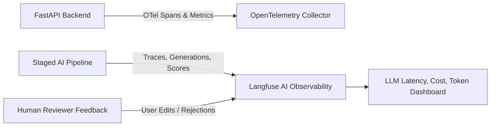

# NEXUS: AI Evaluation & Observability Framework

**Document Version:** 1.0.0  
**Status:** Canonical Source of Truth  

---

## 1. Evaluation Dimensions & Quantitative Metrics

NEXUS establishes rigorous quantitative benchmarks to evaluate every release against a **Golden Dataset** of complex documents and ground-truth Action Graphs.

| Evaluation Metric | Target Threshold | Measurement Method |
| :--- | :--- | :--- |
| **Extraction Precision & Recall** | $\ge 92\%$ | F1 score of extracted Facts and Tasks against human ground-truth labels. |
| **Temporal / Deadline Accuracy** | $\ge 95\%$ | Exact match on absolute ISO-8601 timestamps and timezone resolution. |
| **Dependency Graph Correctness** | $\ge 90\%$ | Precision/recall of directed `depends_on` and `requires` edges; 0 undetected cycles. |
| **Source Grounding & Attribution** | $\ge 98\%$ | Verbatim string match of citations against source document chunk text. |
| **Hallucination Rate** | $\le 1\%$ | Rate of fabricated entities with no verifiable backing in ingested context. |
| **JSON Schema Conformance** | $100\%$ | Percentage of LLM outputs passing Pydantic v2 validation (with max 2 retry repairs). |
| **P95 Extraction Latency** | $< 15s$ | End-to-end wall time for 10-page technical document parsing to Action Graph. |

---

## 2. Observability Architecture (Langfuse & OpenTelemetry)

### 2.1 Langfuse Integration
- **Trace Hierarchy:** Each document ingestion creates a root trace; each pipeline stage (`classification`, `fact_extraction`, `task_synthesis`, `dependency_resolution`) creates a nested child span with token counts, latency, and raw prompt/output snapshots.
- **Human Correction Tracking:** When a user modifies an AI-generated task or deletes a false dependency, a negative score event is emitted to Langfuse to pinpoint underperforming prompts or models.

### 2.2 OpenTelemetry Metrics
- `nexus_ingest_documents_total` (counter, by file type and status)
- `nexus_graph_nodes_total` (gauge, by entity type and state)
- `nexus_ai_stage_duration_seconds` (histogram, by pipeline stage and provider)
- `nexus_ai_retry_count_total` (counter, by reason)
