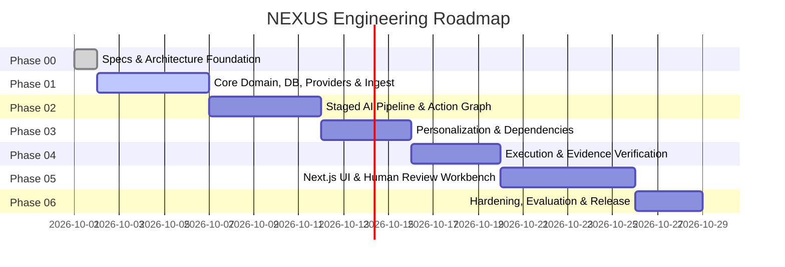

# NEXUS: Development Phases & Implementation Roadmap

**Document Version:** 1.0.0  
**Status:** Canonical Source of Truth  

---

## 1. Phased Delivery Roadmap

NEXUS strictly follows a staged, phased engineering process. Each phase must satisfy all acceptance criteria before subsequent phases commence.

---

## 2. Phase Specifications & Scope

### Phase 00 — System Initialization & Architecture Foundation (COMPLETED)
- **Scope:** Workspace inspection, architectural definition, source of truth specifications (`/docs`), prompt architecture structure (`/prompts`), repository configuration (`.gitignore`, `.env.example`, `docker-compose.yml` baseline).
- **Exit Criteria:** All specifications approved; zero application code written prematurely.

### Phase 01 — Core Domain Models, Database Schemas, LLM Provider Abstraction & Ingestion Baseline
- **Scope:**
  - Python project configuration (`pyproject.toml`, FastAPI app bootstrap).
  - PostgreSQL + pgvector schema models via SQLAlchemy 2.0 and Alembic migrations.
  - Core domain entity definitions (User, Document, Chunk, Fact, Task, Edge, Evidence).
  - Provider-agnostic `LLMProvider` interface with implementations: `GeminiProvider`, `OllamaProvider`, `MockLLMProvider`.
  - Document ingestion parser integration (Docling baseline) with chunking and SHA-256 integrity hashing.
  - Comprehensive unit and integration test suite for models and providers.
- **Exit Criteria:** `pytest` passes 100%; document upload and parsing test green with mock and local providers.

### Phase 02 — Staged AI Extraction Pipeline & Action Graph Construction
- **Scope:**
  - Pipeline orchestrator implementing Stages 1 through 6.
  - Grounded fact extractor with verbatim citation enforcement.
  - Task synthesis engine with strict Pydantic v2 schema validation and JSON repair loop.
  - Temporal deadline parser (ISO-8601 absolute resolution).
  - Graph edge generator linking documents, facts, and tasks.
  - Integration with Langfuse for trace logging.
- **Exit Criteria:** Multi-page PDF ingested → candidate tasks and grounded facts generated with 100% schema validity and verified source citations.

### Phase 03 — Personalization, Relevance Scoring & Dependency Resolution Engine (COMPLETED)
- **Scope:**
  - Action Graph topological sorting and cycle detection algorithms (Tarjan's).
  - Dependency edge inference engine (`depends_on`, `requires`, `blocks`).
  - Personalization engine scoring task relevance against user profiles/roles.
  - Conflict resolution module flagging contradictory claims across documents.
- **Exit Criteria:** Complex 5-task dependency graph generated without cycles; cyclic test cases successfully detected and flagged `CONFLICT`.

### Phase 04 — Execution Verification & Evidence Collection Engine
- **Scope:**
  - Evidence submission API endpoints (`/api/v1/tasks/{id}/evidence`).
  - Automated verification rule evaluators (verifying commit hashes, URLs, file artifacts, and text criteria).
  - Task state machine execution (`PENDING_VERIFICATION` → `COMPLETED`).
  - Immutable audit logging for state transitions.
- **Exit Criteria:** Evidence uploaded → criteria verified → task completed → dependent tasks unlocked.

### Phase 05 — Next.js Action Graph UI, Human-in-the-Loop Workbench & Observability
- **Scope:**
  - Next.js 15+ dashboard with interactive Action Graph DAG canvas (React Flow / custom SVG).
  - Side-by-side document citation viewer with highlight overlays.
  - Human review approval gate interface (Authorize, Reject, Edit).
  - Real-time updates via Server-Sent Events (SSE).
  - Playwright E2E test suite.
- **Exit Criteria:** Complete user flow from document upload to graph visualization and task approval tested via Playwright.

### Phase 06 — Production Hardening, Golden Benchmark Suite & Release
- **Scope:**
  - Performance tuning (pgvector HNSW index optimizations, caching).
  - Golden dataset evaluation suite executing precision/recall benchmarks.
  - Security audit (threat model verification, prompt injection defense tests).
  - Documentation finalization and open-source release preparation.
- **Exit Criteria:** All evaluation targets met ($\ge 92\%$ extraction precision, $\le 1\%$ hallucination rate); security audit passed.
